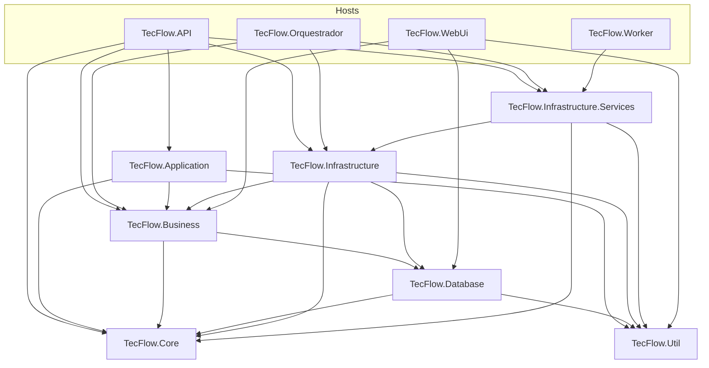
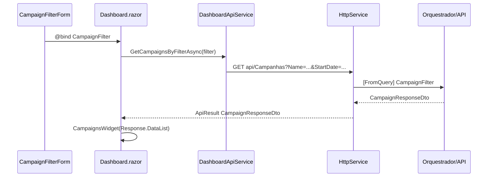

# 🏗️ DIAGRAMAS VISUAIS: ARQUITETURA ATUAL vs PROPOSTA

[« Voltar para o Índice Completo](./INDICE_COMPLETO.md) · [README principal](../README.md) · [Lista de mudanças](./LISTA_ARQUIVOS_MUDANCAS.md)

> **Raiz da solution:** `c:\Programacao\Tecso.AutomacaoCusor\` (`TecFlow.sln`).  
> **Painel de controle:** [README.md](../README.md) · **Varredura física:** 3 de junho de 2026  
> **Divergências / limpeza:** [LISTA_ARQUIVOS_MUDANCAS.md](./LISTA_ARQUIVOS_MUDANCAS.md)

---

## 📊 DIAGRAMA 1: ESTRUTURA FÍSICA ATUAL (fiel ao disco)

```
Tecso.AutomacaoCusor/
├── README.md                    # Painel principal (roadmap + regras)
├── TecFlow.sln
├── .gitignore
├── docs/                        # Documentação (este arquivo, LISTA, ANALISE, …)
│
├── TecFlow.Core/
│   ├── Entities/                # 11 entidades de domínio (Campaign, Product, …)
│   └── Exceptions/              # BaseCustomException, NotFound, Unauthorized, ExceptionMiddleware
│
├── TecFlow.Business/
│   ├── Dto/                     # *Dto, *ResponseDto, ResponseDto, Auth/
│   ├── Enum/                    # (pasta reservada — vazia no momento)
│   ├── Interfaces/
│   │   ├── Repositories/        # I*Repository (7 contratos)
│   │   └── Services/            # I*Service, ITikTok*, IShopee*, helpers legados
│   ├── Pipelines/               # ColetaDados, GeracaoConteudo, Publicacao
│   └── Service/
│       ├── Application/         # *ApplicationService + AddTecFlowApplicationServices()
│       ├── CryptographyHelper.cs
│       └── ValidationHelper.cs
│
├── TecFlow.Database/
│   ├── AppDbContext.cs          # DbContext principal
│   ├── Entity/                  # UserEntity
│   ├── Filter/                  # *Filter + FilterQueryExtensions
│   ├── Interface/               # (vazia — contratos em Business.Interfaces)
│   ├── Pagin/                   # PagedResult, QueryableExtensions
│   ├── Prompts/                 # GeracaoDescricao, Roteiro, Titulo
│   └── Repositorio/             # AppDbContextFactory
│
├── TecFlow.Application/         # ⚠️ Residual
│   └── Controller/              # AuthController.cs (stub — não é controller HTTP)
│
├── TecFlow.Infrastructure/
│   ├── API/                     # Shopee/, TikTok/ (+ Models/)
│   ├── Configuration/           # AppConfiguration, SerilogLogger
│   ├── Data/                    # DataService, Configurations/ (sem AppDbContext)
│   ├── Interfaces/              # IAppConfiguration, IUserContextProvider, ILoggerService
│   ├── Migrations/              # EF migrations (legado — alinhar com Database)
│   ├── Security/                # JwtTokenService, UserContextProvider
│   └── Services/Security/       # LegacyCredentialReEncrypt*
│
├── TecFlow.Infrastructure.Services/
│   ├── Repositories/            # 6 repositórios (Affiliate, Campaign, Content, …)
│   ├── Service/ExternalServices/ # Gemini, OpenAI, Shopee, TikTok*, Ranking, …
│   ├── Interfaces/              # ⚠️ fantasmas (vários Compile Remove no csproj)
│   ├── ServiceRegistrationExtensions.cs
│   ├── CoreServiceRegistrationExtensions.cs      # ⚠️ ainda separado
│   ├── ExternalServiceRegistrationExtensions.cs
│   ├── InfrastructureDataServiceRegistrationExtensions.cs
│   └── DatabaseUrlConfiguration.cs
│
├── TecFlow.API/
│   ├── Controllers/             # 11 controllers (+ WeatherForecast scaffold)
│   ├── Program.cs               # DI: Core + Infra + Data + Application (Business)
│   ├── Properties/
│   └── (sem Middleware/*.cs — ExceptionMiddleware só no Core)
│
├── TecFlow.Orquestrador/
│   ├── Controllers/             # Auth, Campaigns, Dashboard, Metrics, UserAccounts
│   ├── Extensions/              # DatabaseExtensions, DemoDataSeeder
│   ├── Interfaces/
│   ├── Pipelines/
│   ├── Program.cs               # DI alinhado à API
│   └── OrquestradorPrincipal.cs
│
├── TecFlow.WebUi/               # Blazor UI canônico (Fase 3)
│   ├── Components/, Services/, Extensions/, Models/, wwwroot/, …
│   └── → TecFlow.Business (*ResponseDto, DashboardSummaryDto)
│
├── TecFlow.Worker/              # Program.cs, WorkerService.cs
├── TecFlow.Tests/               # Mock/, Integration/, Unit/, Services/, …
├── TecFlow.Util/                # Address/, Security/, Validation/
└── (externo na sln) ../Tecso.LerArquivos/
```

### Mapa de dependências entre projetos (referência de compilação)



---

## 📊 DIAGRAMA 2: DIVERGÊNCIAS (diagrama × disco)

| Item no diagrama antigo | Situação real (jun/2026) |
|-------------------------|---------------------------|
| `TecFlow.Core/Interfaces/` | **Removido** — contratos em `TecFlow.Business/Interfaces/` |
| `TecFlow.Core/Dto`, `Prompts` | **Movidos** — Dtos em Business; Prompts em Database |
| `TecFlow.Application/Services/*` | **Movidos** — `TecFlow.Business/Service/Application/` |
| `Infrastructure/Data/AppDbContext` | **Movido** — `TecFlow.Database/AppDbContext.cs` |
| `API/Middleware/ExceptionMiddleware` | **Removido da API** — único em `Core/Exceptions/` |
| `Orquestrador` "Hello World" | **Obsoleto** — `Program.cs` completo com DI |
| `TecFlow.Portal` / `TecFlow.Dashboard` | **Removidos** — UI canônica em `TecFlow.WebUi` |
| 4 arquivos `*RegistrationExtensions` | **Ainda separados** — consolidação pendente |
| `Infrastructure.Services/Interfaces/*.cs` | **Fantasmas** — excluídos do compile, ainda no disco |

---

## 🔄 DIAGRAMA 3: FLUXO DE DEPENDENCY INJECTION (jun/2026)

```
┌─────────────────────────────────────────────────────────────────┐
│ TecFlow.API / TecFlow.Orquestrador (mesmo padrão de DI)           │
└─────────────────────────────────────────────────────────────────┘
                              │
    ┌─────────────────────────────────────────────────────────────┐
    │ Program.cs                                                   │
    │ ✓ AddTecFlowCoreServices()                                   │
    │ ✓ AddTecFlowInfrastructureServices(config)                     │
    │ ✓ AddTecFlowInfrastructureData(config)  → DbContext + repos  │
    │ ✓ AddTecFlowApplicationServices()       → TecFlow.Business   │
    │ ✓ JWT (API) + Serilog + Controllers                        │
    │ ✓ UseMiddleware<ExceptionMiddleware>()  → TecFlow.Core       │
    └─────────────────────────────────────────────────────────────┘
                              │
         ┌────────────────────┼────────────────────┐
         ▼                    ▼                    ▼
   Controllers          Business.AppServices    Infra.Services
   (Filter/Dto/         (Campaigns, Products,   (Repositories,
    ResponseDto)         Metrics, AI, …)          External APIs)
```

**Pendências de DI (ver LISTA):** consolidar 4 `*RegistrationExtensions` em um arquivo; remover interfaces fantasma em `Infrastructure.Services/Interfaces/`.

---

## ✅ DIAGRAMA 4: ALVOS ARQUITETURAIS (ainda não 100% no disco)

```
┌─────────────────────────────────────────────────────────────────┐
│            EXTENSION METHODS (COMPARTILHADO)                    │
├─────────────────────────────────────────────────────────────────┤
│                                                                  │
│ TecFlow.Infrastructure.Services/                                 │
│   ServiceRegistrationExtensions.cs (ÚNICO)                      │
│   └─ AddTecFlowInfrastructureServices(config) ✓✓                │
│      ├─ DbContext                                               │
│      ├─ 6 Repositories                                          │
│      ├─ 4 Business Services                                     │
│      └─ 5 External API HttpClients                              │
│                                                                  │
│ TecFlow.Business/Service/Application/                             │
│   ApplicationServiceCollectionExtensions.cs                     │
│   └─ AddTecFlowApplicationServices() ✓ (já em uso na API/Orq)    │
│      └─ 9 ApplicationServices                                   │
│                                                                  │
│ TecFlow.API/                                                      │
│   Authentication/ServiceRegistrationExtensions.cs               │
│   └─ AddTecFlowAuthentication(config) ✓✓                         │
│      ├─ JWT                                                     │
│      └─ IUserContextProvider                                    │
│                                                                  │
└─────────────────────────────────────────────────────────────────┘
     △                          △                        △
     │                          │                        │
     └──────────┬───────────────┼────────────┬──────────┘
                │               │            │
    ┌───────────┴────────┐      │   ┌────────┴──────────┐
    ▼                    ▼      ▼   ▼                   ▼
┌──────────────────┐  ┌──────────────────────────┐  ┌─────────────────┐
│  TecFlow.API       │  │  TecFlow.ORQUESTRADOR      │  │ TecFlow.DASHBOARD │
│                  │  │                          │  │ (se precisar)   │
│ Program.cs:      │  │ Program.cs: ✓✓           │  │                 │
│ ✓ AddTecFlowInfra  │  │ await Configurator       │  │ Program.cs:     │
│ ✓ AddTecFlowAppSvcs│  │   .ConfigureAndRunAsync()│  │ ✓ AddTecFlowInfra │
│ ✓ AddTecFlowAuth   │  │                          │  │ ✓ AddTecFlowAppSvcs
│                  │  │ Configurator.cs:         │  │ ✓ AddTecFlowAuth  │
│ Controllers      │  │ ✓ AddTecFlowInfra          │  │                 │
│ (Endpoints HTTP) │  │ ✓ AddTecFlowAppSvcs        │  │ Controllers/    │
│                  │  │ ✓ AddTecFlowAuth           │  │ Views/Pages     │
│                  │  │                          │  │                 │
└──────────────────┘  │ OrquestradorService ✓✓  │  └─────────────────┘
                      │ (Lógica pura)           │
                      │                          │
                      │ Pipelines                │
                      │ (ColetaDados, Conteúdo) │
                      └──────────────────────────┘

✓✓ TODOS USAM OS MESMOS EXTENSION METHODS!
✓✓ SINCRONIZADOS AUTOMATICAMENTE!
✓✓ FÁCIL ADICIONAR NOVOS SERVIÇOS!
```

---

## 📂 DIAGRAMA 5: ESTRUTURA DE INTERFACES (físico — jun/2026)

### Canônico (em uso)
```
TecFlow.Business/Interfaces/
├── Repositories/
│   ├── IRepository.cs
│   ├── IAffiliateRepository.cs
│   ├── ICampaignRepository.cs
│   ├── IContentRepository.cs
│   ├── IMetricRepository.cs
│   ├── IProductRepository.cs
│   ├── IUserAccountRepository.cs
│   └── IAIProvider.cs, IOrquestradorRepository.cs
│
└── Services/
    ├── IAIService, IGeminiService, IDataService, …
    ├── IShopeeApi, ITikTokShopApi, ITikTokAdsApiService
    └── AnaliseService.cs, ProdutoService.cs, UsuarioService.cs  # ⚠️ impl. com nome de serviço

TecFlow.Infrastructure/Interfaces/
├── IAppConfiguration.cs
├── IUserContextProvider.cs
└── ILoggerService.cs
```

### Legado no disco (limpar)
```
TecFlow.Infrastructure.Services/Interfaces/
├── IShopeeApi.cs, ITikTokShopApi.cs, ITikTokAdsApiService.cs  # Compile Remove
└── ITikTokShopApiService.cs  # namespace TecFlow.Core.Interfaces.Services
```

---

## 🗺️ DIAGRAMA 6: MAPA DE DEPENDÊNCIAS — REPOSITÓRIOS (jun/2026)

```
┌──────────────────────────────────────────────────────────────┐
│ CONTRATOS (TecFlow.Business.Interfaces.Repositories)          │
├──────────────────────────────────────────────────────────────┤
│ IRepository ◄─── BaseEntity (Core)                           │
│ IAffiliateRepository, ICampaignRepository, IContentRepository │
│ IMetricRepository, IProductRepository, IUserAccountRepository │
│ IOrquestradorRepository, IAIProvider                         │
└──────────────────────────────────────────────────────────────┘
                           △
                           │
        ┌──────────────────┴──────────────────┐
        │                                     │
┌───────┴──────────────────┐        ┌────────┴──────────────┐
│ IMPLEMENTAÇÕES           │        │ ONDE REGISTRADOS      │
│ (Infra.Services/         │        │ (API/Prog ou Orq)     │
│  Repositories)           │        │                       │
├──────────────────────────┤        ├──────────────────────┤
│ AffiliateRepository      │────────│ AddTecFlowInfrastructureData │
│ CampaignRepository       │────────│ (API + Orquestrador)         │
│ ContentRepository        │────────│                              │
│ MetricRepository         │────────│                              │
│ ProductRepository        │────────│                              │
│ UserAccountRepository    │────────│                              │
└──────────────────────────┘        └──────────────────────┘


┌──────────────────────────────────────────────────────────────┐
│ SERVICES (TecFlow.Business.Interfaces.Services)               │
├──────────────────────────────────────────────────────────────┤
│ Contratos ──► Implementações (Infrastructure.Services)       │
│   IAIService ──► OpenAIService                               │
│   IGeminiService ──► GeminiService                             │
│   IShopeeApi / ITikTokShopApi / ITikTokAdsApiService         │
│   IScoreService, IRankingService, …                          │
│                                                              │
│ Application (TecFlow.Business/Service/Application/)          │
│   AddTecFlowApplicationServices() ✓ chamado na API e Orq     │
└──────────────────────────────────────────────────────────────┘


┌──────────────────────────────────────────────────────────────┐
│ REGISTRATION (⚠️ ainda 4 arquivos + 1 em Business)           │
├──────────────────────────────────────────────────────────────┤
│ Infrastructure.Services: ServiceRegistrationExtensions,      │
│   Core*, External*, InfrastructureData*                      │
│ Business: ApplicationServiceCollectionExtensions ✓           │
└──────────────────────────────────────────────────────────────┘
```

---

## 🗺️ DIAGRAMA 7: ALVO DE DEPENDÊNCIAS (parcialmente implementado)

> **Nota:** Bloco abaixo descreve o estado **desejado**. Contratos já estão em `TecFlow.Business`; consolidação de DI e remoção de `Infrastructure.Services/Interfaces/` ainda pendente.

```
┌──────────────────────────────────────────────────────────────┐
│ INTERFACES (alvo: TecFlow.Business — hoje já é o canônico)   │
├──────────────────────────────────────────────────────────────┤
│ Interfaces/Repositories/ (9)                                 │
│ Interfaces/Services/Business/ (8)                            │
│ Interfaces/Services/ExternalApis/ (4) ← MOVIDAS               │
│ Interfaces/Infrastructure/ (3)                               │
└──────────────────────────────────────────────────────────────┘
                           △
                           │
        ┌──────────────────┴──────────────────┐
        │                                     │
┌───────┴──────────────────┐        ┌────────┴──────────────┐
│ IMPLEMENTAÇÕES           │        │ EXTENSÕES           │
│ (Infra.Services,         │        │ (Extension Methods)  │
│  Infra/Data,             │        │                      │
│  Application)            │        ├──────────────────────┤
├──────────────────────────┤        │ TecFlow.Infrastructure │
│ AfiliadoRepository       │────┐   │ .Services            │
│ CampanhaRepository       │────┤   │ ServiceRegExtensions │
│ ... (6 repos total)      │    │   │ └─ AddTecFlowInfra  ✓✓ │
│                          │    │   │                      │
│ DataService              │    │   │ TecFlow.Business       │
│ OpenAIService            │────┼───│ Service/Application  │
│ GeminiService            │    │   │ └─ AddTecFlowAppSvcs ✓ │
│ ShopeeApiService         │    │   │                      │
│ TikTokAdsApiService      │    │   │                      │
│ TikTokShopApiService     │    │   │ TecFlow.API            │
│ RankingService           │    │   │ Authentication       │
│ ScoreService             │    │   │ ServiceRegExtensions │
│ ... (11+ total)          │    │   │ └─ AddTecFlowAuth   ✓✓ │
│                          │    │   │                      │
│ 11 ApplicationServices ──┼────┘   └──────────────────────┘
│ (sem duplicatas)         │
│                          │
└──────────────────────────┘
         │
         │
    ┌────┴────────────────────────┐
    │ USADOS EM TODOS OS PROJETOS │
    ├────────────────────────────┤
    │ TecFlow.API                   │
    │ TecFlow.Orquestrador          │
    │ TecFlow.WebUi                 │
    │ TecFlow.Worker (se usar)      │
    └────────────────────────────┘

✓✓ ÚNICA FONTE DE VERDADE
✓✓ FÁCIL SINCRONIZAR
✓✓ SEM DUPLICATAS
```

---

## 🔄 DIAGRAMA 8: CICLO DE IMPLEMENTAÇÃO

```
┌─────────────────┐
│   START         │
└────────┬────────┘
         │
         ▼
┌─────────────────────────────────────┐
│ FASE 1: Consolidar Registration    │
│ (1 hora - 4 arquivos → 1 arquivo) │
└────────┬────────────────────────────┘
         │
         ▼
┌─────────────────────────────────────┐
│ FASE 2: Mover Arquivos             │
│ (1.5 horas - reorganizar)          │
│ ✓ Interfaces para Core             │
│ ✓ Impls fora de Interfaces         │
│ ✓ Arquivos soltos organizados      │
└────────┬────────────────────────────┘
         │
         ▼
┌─────────────────────────────────────┐
│ FASE 3: Criar Novos Arquivos       │
│ (1 hora - novos extension methods) │
└────────┬────────────────────────────┘
         │
         ▼
┌─────────────────────────────────────┐
│ FASE 4: Editar Existentes          │
│ (1.5 horas - Program.cs, etc.)    │
└────────┬────────────────────────────┘
         │
         ▼
┌─────────────────────────────────────┐
│ FASE 5: Testes e Validação        │
│ (1 hora - compile, run, test)     │
└────────┬────────────────────────────┘
         │
         ▼
┌─────────────────┐
│ ✅ COMPLETE    │
│ 4-6 horas      │
└─────────────────┘
```

---

## 📋 LEGENDA

| Símbolo | Significado |
|---------|------------|
| ✓ | Correto, sem problemas |
| ✓✓ | Muito bom, recomendado |
| ✓✓✓ | Otimizado, excelente |
| ⚠️ | Atenção, possível problema |
| ❌ | Erro, crítico |
| 🟢 | Status OK |
| 🟡 | Status em desenvolvimento/incompleto |
| 🔴 | Status crítico |
| △ | Fluxo ascendente |
| ▼ | Fluxo descendente |

---

## 🖥️ DIAGRAMA 4: FLUXO WebUi — Filter / Dto / ResponseDto (Fase 3)

```
┌──────────────────────────────────────────────────────────────────────────┐
│ TecFlow.WebUi (Blazor Server)                                            │
│  CampaignFilterForm ──bind──► CampaignFilter                             │
│  MetricFilterForm   ──bind──► MetricFilter                               │
│  CampaignCreateForm ──bind──► CampaignDto                                  │
│  Dashboard.razor → IDashboardApiService → HttpService + query string    │
└───────────────────────────────┬──────────────────────────────────────────┘
                                │ HTTP + Bearer
                                ▼
┌──────────────────────────────────────────────────────────────────────────┐
│ TecFlow.Orquestrador / TecFlow.API                                       │
│  GET  api/Campanhas?[CampaignFilter]  → CampaignResponseDto              │
│  GET  api/Metricas?[MetricFilter]     → MetricResponseDto                │
│  POST api/Campanhas (CampaignDto)     → CampaignResponseDto              │
│  POST api/Metricas  (MetricDto)       → MetricResponseDto                │
└───────────────────────────────┬──────────────────────────────────────────┘
                                │
                                ▼
┌──────────────────────────────────────────────────────────────────────────┐
│ Widgets leem ResponseDto.DataList (Campaign, Metric) + Status/Descricao   │
└──────────────────────────────────────────────────────────────────────────┘
```



---

**FIM DOS DIAGRAMAS**

*Sincronizado com pastas físicas em 03/06/2026.*  
*Próximo:* [README.md](../README.md) · [LISTA_ARQUIVOS_MUDANCAS.md](./LISTA_ARQUIVOS_MUDANCAS.md) · [INDICE_COMPLETO.md](./INDICE_COMPLETO.md)
