# 🏗️ DIAGRAMAS VISUAIS: ARQUITETURA ATUAL vs PROPOSTA

[« Voltar para o Índice Completo](./INDICE_COMPLETO.md) · [README principal](../README.md) · [Lista de mudanças](./LISTA_ARQUIVOS_MUDANCAS.md)

> **Raiz da solution:** `c:\Programacao\Tecso.AutomacaoCusor\` (`TecFlow.sln`).  
> **Painel de controle:** [README.md](../README.md) · **Varredura física:** 3 de junho de 2026  
> **Divergências / limpeza:** [LISTA_ARQUIVOS_MUDANCAS.md](./LISTA_ARQUIVOS_MUDANCAS.md)

---

## 🔌 INTEGRAÇÕES EXTERNAS — TikTok Shop & Shopee (Fase 3)

> **Estratégia de acoplamento (jun/2026):** contratos e opções de configuração ficam em **`TecFlow.Business/Integrations/`**; implementações HTTP (HttpClient nomeado, Polly, logging handler) ficam em **`TecFlow.Infrastructure.Services/Integrations/`**. Os serviços legados em `Business/Interfaces/Services/` (`ITikTokShopApi`, `IShopeeApi`) serão gradualmente adaptados para delegar aos novos *Integration Clients* nas fases 3.2–3.4.

```
TecFlow.Business/Integrations/
├── Common/                          # Opções compartilhadas, nomes de HttpClient
├── TikTokShop/                      # ITikTokShopIntegrationClient + Options (AppKey/AppSecret)
└── Shopee/                          # IShopeeIntegrationClient + Options (PartnerId/PartnerKey)

TecFlow.Infrastructure.Services/Integrations/
├── Common/                          # ExternalApiLoggingHandler, políticas Polly
├── TikTokShop/                      # TikTokShopIntegrationClient
├── Shopee/                          # ShopeeIntegrationClient
└── IntegrationHttpClientRegistrationExtensions.cs  # DI: AddTecFlowIntegrationHttpClients()
```

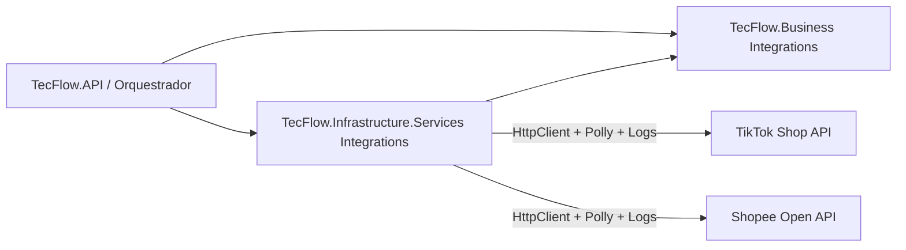

**Configuração:** seção `Integrations` em `appsettings.json` (hosts API/Orquestrador/Worker) — chaves de produção via variáveis de ambiente ou User Secrets, nunca commitadas.

### Fluxo OAuth2 (Fase 3.2)

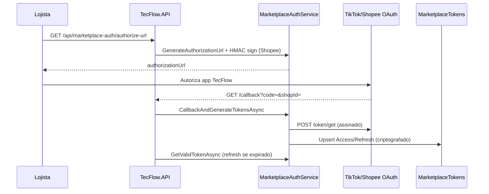

### Fluxo de catálogo — Sincronização de produtos (Fase 3.3)

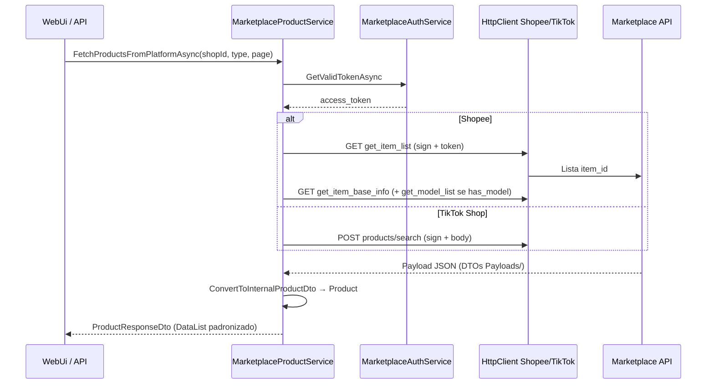

```
TecFlow.Business/Integrations/
├── Catalog/                     # IMarketplaceProductService
├── Shopee/Payloads/             # get_item_list, get_item_base_info, get_model_list
└── TikTokShop/Payloads/         # products/search

TecFlow.Infrastructure.Services/Integrations/Catalog/
├── MarketplaceProductService.cs
├── MarketplaceProductMapper.cs
└── MarketplaceProductRegistrationExtensions.cs
```

### Fluxo Pedidos & Estoque (Fase 3.4)

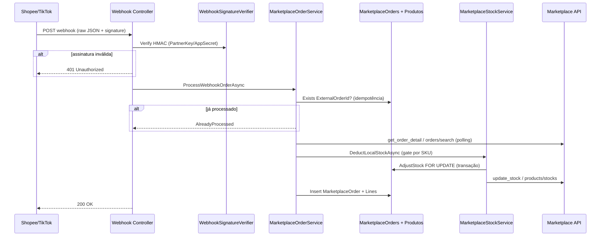

**Endpoints públicos (webhooks):**

| Método | Rota | Validação |
|--------|------|-----------|
| POST | `/api/webhooks/shopee` | Header `Authorization` = HMAC-SHA256(`WebhookCallbackUrl\|body`, PartnerKey) |
| POST | `/api/webhooks/tiktokshop` | Header `Webhook-Signature` ou `Tiktok-Signature` (HMAC com AppSecret/WebhookSecret) |

**Endpoints autenticados:**

| Método | Rota | Função |
|--------|------|--------|
| POST | `/api/marketplace-orders/poll` | Polling de contingência (`get_order_list` / `orders/search`) |
| PUT | `/api/Produtos/{id}` | Estoque local alterado → `UpdatePlatformStockAsync` se SKU vinculado |

**Concorrência:** `StockConcurrencyGate` serializa por `marketplace:shopId:sku`; `AdjustStockAsync` usa transação no PostgreSQL.

### Cobertura de testes automatizados (TecFlow.Tests)

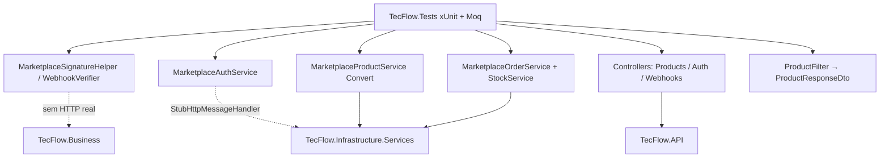

| Área Fase 3 | Classes de teste | Caminho feliz | Caminho triste |
|-------------|------------------|---------------|----------------|
| Assinatura HMAC | `MarketplaceSignatureHelperTests`, `MarketplaceWebhookSignatureVerifierTests` | assinatura válida | header ausente / expirado |
| OAuth | `MarketplaceAuthServiceTests` | URL + token válido + refresh | redirect vazio / token ausente |
| Catálogo | `MarketplaceProductServiceTests` | Shopee item/variante, TikTok SKU | `shopId` vazio |
| Pedidos | `MarketplaceOrderServiceTests` | webhook + baixa estoque | JSON inválido / idempotência |
| Estoque | `MarketplaceStockServiceTests` | dedução local | SKU não vinculado |
| API 3 objetos | `ProductsControllerResponseDtoTests`, `ProductFilterExtensionsTests` | `DataList` / NotFound | filtro sem match |

---

## 📊 DIAGRAMA 1: ESTRUTURA FÍSICA ATUAL (fiel ao disco)

```
Tecso.AutomacaoCusor/
├── README.md                    # Painel principal (roadmap + regras)
├── TecFlow.sln
├── .gitignore
├── docs/                        # Documentação (este arquivo, LISTA, ANALISE, …)
│
├── TecFlow.Core/
│   ├── Entities/                # 11 entidades de domínio (Campaign, Product, …)
│   ├── Enums/                   # MarketplaceType (Shopee, TikTokShop)
│   └── Exceptions/              # BaseCustomException, NotFound, Unauthorized, ExceptionMiddleware
│
├── TecFlow.Business/
│   ├── Dto/                     # *Dto, *ResponseDto, ResponseDto, Auth/
│   ├── Integrations/            # Contratos + Options + Auth (TikTokShop, Shopee)
│   │   ├── Auth/                # IMarketplaceAuthService, IMarketplaceSignatureService
│   │   ├── Common/              # MarketplaceSignatureHelper, HttpClient names
│   │   ├── TikTokShop/
│   │   └── Shopee/
│   ├── Enum/                    # (pasta reservada — vazia no momento)
│   ├── Interfaces/
│   │   ├── Repositories/        # I*Repository (7 contratos)
│   │   └── Services/            # I*Service, ITikTok*, IShopee*, helpers legados
│   ├── Pipelines/               # ColetaDados, GeracaoConteudo, Publicacao
│   └── Service/
│       ├── Application/         # *ApplicationService + AddTecFlowApplicationServices()
│       ├── CryptographyHelper.cs
│       └── ValidationHelper.cs
│
├── TecFlow.Database/
│   ├── AppDbContext.cs          # DbContext principal
│   ├── Entity/                  # UserEntity
│   ├── Filter/                  # *Filter + FilterQueryExtensions
│   ├── Interface/               # (vazia — contratos em Business.Interfaces)
│   ├── Pagin/                   # PagedResult, QueryableExtensions
│   ├── Prompts/                 # GeracaoDescricao, Roteiro, Titulo
│   └── Repositorio/             # AppDbContextFactory
│
├── TecFlow.Application/         # ⚠️ Residual
│   └── Controller/              # AuthController.cs (stub — não é controller HTTP)
│
├── TecFlow.Infrastructure/
│   ├── API/                     # Shopee/, TikTok/ (+ Models/)
│   ├── Configuration/           # AppConfiguration, SerilogLogger
│   ├── Data/                    # DataService, Configurations/ (sem AppDbContext)
│   ├── Interfaces/              # IAppConfiguration, IUserContextProvider, ILoggerService
│   ├── Migrations/              # EF migrations (legado — alinhar com Database)
│   ├── Security/                # JwtTokenService, UserContextProvider
│   └── Services/Security/       # LegacyCredentialReEncrypt*
│
├── TecFlow.Infrastructure.Services/
│   ├── Integrations/            # HttpClients, Polly, ExternalApiLoggingHandler — Fase 3.1+
│   ├── Repositories/            # 6 repositórios (Affiliate, Campaign, Content, …)
│   ├── Service/ExternalServices/ # Gemini, OpenAI, Shopee, TikTok*, Ranking, …
│   ├── Interfaces/              # ⚠️ fantasmas (vários Compile Remove no csproj)
│   ├── ServiceRegistrationExtensions.cs
│   ├── CoreServiceRegistrationExtensions.cs      # ⚠️ ainda separado
│   ├── ExternalServiceRegistrationExtensions.cs
│   ├── InfrastructureDataServiceRegistrationExtensions.cs
│   └── DatabaseUrlConfiguration.cs
│
├── TecFlow.API/
│   ├── Controllers/             # 11 controllers (+ WeatherForecast scaffold)
│   ├── Program.cs               # DI: Core + Infra + Data + Application (Business)
│   ├── Properties/
│   └── (sem Middleware/*.cs — ExceptionMiddleware só no Core)
│
├── TecFlow.Orquestrador/
│   ├── Controllers/             # Auth, Campaigns, Dashboard, Metrics, UserAccounts
│   ├── Extensions/              # DatabaseExtensions, DemoDataSeeder
│   ├── Interfaces/
│   ├── Pipelines/
│   ├── Program.cs               # DI alinhado à API
│   └── OrquestradorPrincipal.cs
│
├── TecFlow.SharedUi/            # RCL UI compartilhada (Fase 4.2)
├── TecFlow.WebUi/               # Host Blazor Server + OAuth (Fase 3/4)
├── TecFlow.Mobile/              # MAUI Blazor Hybrid (Fase 4.2)
│   ├── Components/, Services/, Extensions/, Models/, wwwroot/, …
│   └── → TecFlow.Business (*ResponseDto, DashboardSummaryDto)
│
├── TecFlow.Worker/              # Program.cs, WorkerService.cs
├── TecFlow.Tests/               # Mock/, Integration/, Unit/, Services/, …
├── TecFlow.Util/                # Address/, Security/, Validation/
└── (externo na sln) ../Tecso.LerArquivos/
```

### Mapa de dependências entre projetos (referência de compilação)

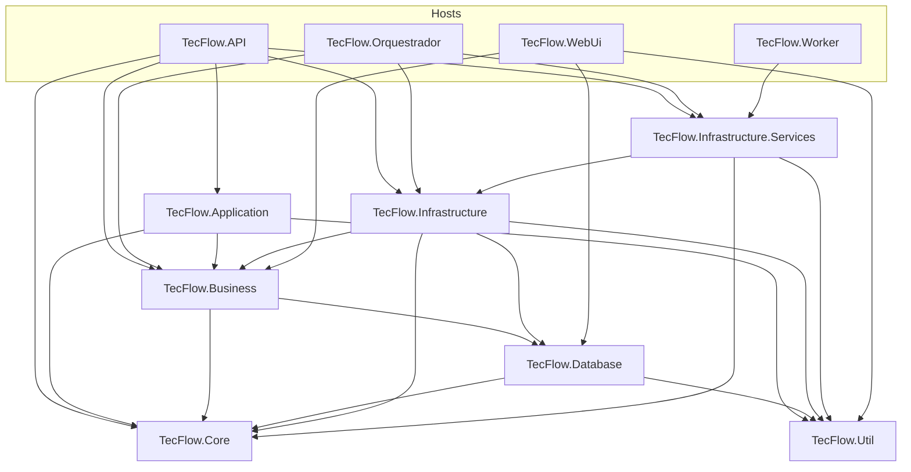

---

## 📊 DIAGRAMA 2: DIVERGÊNCIAS (diagrama × disco)

| Item no diagrama antigo | Situação real (jun/2026) |
|-------------------------|---------------------------|
| `TecFlow.Core/Interfaces/` | **Removido** — contratos em `TecFlow.Business/Interfaces/` |
| `TecFlow.Core/Dto`, `Prompts` | **Movidos** — Dtos em Business; Prompts em Database |
| `TecFlow.Application/Services/*` | **Movidos** — `TecFlow.Business/Service/Application/` |
| `Infrastructure/Data/AppDbContext` | **Movido** — `TecFlow.Database/AppDbContext.cs` |
| `API/Middleware/ExceptionMiddleware` | **Removido da API** — único em `Core/Exceptions/` |
| `Orquestrador` "Hello World" | **Obsoleto** — `Program.cs` completo com DI |
| `TecFlow.Portal` / `TecFlow.Dashboard` | **Removidos** — UI canônica em `TecFlow.WebUi` |
| 4 arquivos `*RegistrationExtensions` | **Ainda separados** — consolidação pendente |
| `Infrastructure.Services/Interfaces/*.cs` | **Fantasmas** — excluídos do compile, ainda no disco |

---

## 🔄 DIAGRAMA 3: FLUXO DE DEPENDENCY INJECTION (jun/2026)

```
┌─────────────────────────────────────────────────────────────────┐
│ TecFlow.API / TecFlow.Orquestrador (mesmo padrão de DI)           │
└─────────────────────────────────────────────────────────────────┘
                              │
    ┌─────────────────────────────────────────────────────────────┐
    │ Program.cs                                                   │
    │ ✓ AddTecFlowCoreServices()                                   │
    │ ✓ AddTecFlowInfrastructureServices(config)                     │
    │ ✓ AddTecFlowInfrastructureData(config)  → DbContext + repos  │
    │ ✓ AddTecFlowApplicationServices()       → TecFlow.Business   │
    │ ✓ JWT (API) + Serilog + Controllers                        │
    │ ✓ UseMiddleware<ExceptionMiddleware>()  → TecFlow.Core       │
    └─────────────────────────────────────────────────────────────┘
                              │
         ┌────────────────────┼────────────────────┐
         ▼                    ▼                    ▼
   Controllers          Business.AppServices    Infra.Services
   (Filter/Dto/         (Campaigns, Products,   (Repositories,
    ResponseDto)         Metrics, AI, …)          External APIs)
```

**Pendências de DI (ver LISTA):** consolidar 4 `*RegistrationExtensions` em um arquivo; remover interfaces fantasma em `Infrastructure.Services/Interfaces/`.

---

## ✅ DIAGRAMA 4: ALVOS ARQUITETURAIS (ainda não 100% no disco)

```
┌─────────────────────────────────────────────────────────────────┐
│            EXTENSION METHODS (COMPARTILHADO)                    │
├─────────────────────────────────────────────────────────────────┤
│                                                                  │
│ TecFlow.Infrastructure.Services/                                 │
│   ServiceRegistrationExtensions.cs (ÚNICO)                      │
│   └─ AddTecFlowInfrastructureServices(config) ✓✓                │
│      ├─ DbContext                                               │
│      ├─ 6 Repositories                                          │
│      ├─ 4 Business Services                                     │
│      └─ 5 External API HttpClients                              │
│                                                                  │
│ TecFlow.Business/Service/Application/                             │
│   ApplicationServiceCollectionExtensions.cs                     │
│   └─ AddTecFlowApplicationServices() ✓ (já em uso na API/Orq)    │
│      └─ 9 ApplicationServices                                   │
│                                                                  │
│ TecFlow.API/                                                      │
│   Authentication/ServiceRegistrationExtensions.cs               │
│   └─ AddTecFlowAuthentication(config) ✓✓                         │
│      ├─ JWT                                                     │
│      └─ IUserContextProvider                                    │
│                                                                  │
└─────────────────────────────────────────────────────────────────┘
     △                          △                        △
     │                          │                        │
     └──────────┬───────────────┼────────────┬──────────┘
                │               │            │
    ┌───────────┴────────┐      │   ┌────────┴──────────┐
    ▼                    ▼      ▼   ▼                   ▼
┌──────────────────┐  ┌──────────────────────────┐  ┌─────────────────┐
│  TecFlow.API       │  │  TecFlow.ORQUESTRADOR      │  │ TecFlow.DASHBOARD │
│                  │  │                          │  │ (se precisar)   │
│ Program.cs:      │  │ Program.cs: ✓✓           │  │                 │
│ ✓ AddTecFlowInfra  │  │ await Configurator       │  │ Program.cs:     │
│ ✓ AddTecFlowAppSvcs│  │   .ConfigureAndRunAsync()│  │ ✓ AddTecFlowInfra │
│ ✓ AddTecFlowAuth   │  │                          │  │ ✓ AddTecFlowAppSvcs
│                  │  │ Configurator.cs:         │  │ ✓ AddTecFlowAuth  │
│ Controllers      │  │ ✓ AddTecFlowInfra          │  │                 │
│ (Endpoints HTTP) │  │ ✓ AddTecFlowAppSvcs        │  │ Controllers/    │
│                  │  │ ✓ AddTecFlowAuth           │  │ Views/Pages     │
│                  │  │                          │  │                 │
└──────────────────┘  │ OrquestradorService ✓✓  │  └─────────────────┘
                      │ (Lógica pura)           │
                      │                          │
                      │ Pipelines                │
                      │ (ColetaDados, Conteúdo) │
                      └──────────────────────────┘

✓✓ TODOS USAM OS MESMOS EXTENSION METHODS!
✓✓ SINCRONIZADOS AUTOMATICAMENTE!
✓✓ FÁCIL ADICIONAR NOVOS SERVIÇOS!
```

---

## 📂 DIAGRAMA 5: ESTRUTURA DE INTERFACES (físico — jun/2026)

### Canônico (em uso)
```
TecFlow.Business/Interfaces/
├── Repositories/
│   ├── IRepository.cs
│   ├── IAffiliateRepository.cs
│   ├── ICampaignRepository.cs
│   ├── IContentRepository.cs
│   ├── IMetricRepository.cs
│   ├── IProductRepository.cs
│   ├── IUserAccountRepository.cs
│   └── IAIProvider.cs, IOrquestradorRepository.cs
│
└── Services/
    ├── IAIService, IGeminiService, IDataService, …
    ├── IShopeeApi, ITikTokShopApi, ITikTokAdsApiService
    └── AnaliseService.cs, ProdutoService.cs, UsuarioService.cs  # ⚠️ impl. com nome de serviço

TecFlow.Infrastructure/Interfaces/
├── IAppConfiguration.cs
├── IUserContextProvider.cs
└── ILoggerService.cs
```

### Legado no disco (limpar)
```
TecFlow.Infrastructure.Services/Interfaces/
├── IShopeeApi.cs, ITikTokShopApi.cs, ITikTokAdsApiService.cs  # Compile Remove
└── ITikTokShopApiService.cs  # namespace TecFlow.Core.Interfaces.Services
```

---

## 🗺️ DIAGRAMA 6: MAPA DE DEPENDÊNCIAS — REPOSITÓRIOS (jun/2026)

```
┌──────────────────────────────────────────────────────────────┐
│ CONTRATOS (TecFlow.Business.Interfaces.Repositories)          │
├──────────────────────────────────────────────────────────────┤
│ IRepository ◄─── BaseEntity (Core)                           │
│ IAffiliateRepository, ICampaignRepository, IContentRepository │
│ IMetricRepository, IProductRepository, IUserAccountRepository │
│ IOrquestradorRepository, IAIProvider                         │
└──────────────────────────────────────────────────────────────┘
                           △
                           │
        ┌──────────────────┴──────────────────┐
        │                                     │
┌───────┴──────────────────┐        ┌────────┴──────────────┐
│ IMPLEMENTAÇÕES           │        │ ONDE REGISTRADOS      │
│ (Infra.Services/         │        │ (API/Prog ou Orq)     │
│  Repositories)           │        │                       │
├──────────────────────────┤        ├──────────────────────┤
│ AffiliateRepository      │────────│ AddTecFlowInfrastructureData │
│ CampaignRepository       │────────│ (API + Orquestrador)         │
│ ContentRepository        │────────│                              │
│ MetricRepository         │────────│                              │
│ ProductRepository        │────────│                              │
│ UserAccountRepository    │────────│                              │
└──────────────────────────┘        └──────────────────────┘


┌──────────────────────────────────────────────────────────────┐
│ SERVICES (TecFlow.Business.Interfaces.Services)               │
├──────────────────────────────────────────────────────────────┤
│ Contratos ──► Implementações (Infrastructure.Services)       │
│   IAIService ──► OpenAIService                               │
│   IGeminiService ──► GeminiService                             │
│   IShopeeApi / ITikTokShopApi / ITikTokAdsApiService         │
│   IScoreService, IRankingService, …                          │
│                                                              │
│ Application (TecFlow.Business/Service/Application/)          │
│   AddTecFlowApplicationServices() ✓ chamado na API e Orq     │
└──────────────────────────────────────────────────────────────┘


┌──────────────────────────────────────────────────────────────┐
│ REGISTRATION (⚠️ ainda 4 arquivos + 1 em Business)           │
├──────────────────────────────────────────────────────────────┤
│ Infrastructure.Services: ServiceRegistrationExtensions,      │
│   Core*, External*, InfrastructureData*                      │
│ Business: ApplicationServiceCollectionExtensions ✓           │
└──────────────────────────────────────────────────────────────┘
```

---

## 🗺️ DIAGRAMA 7: ALVO DE DEPENDÊNCIAS (parcialmente implementado)

> **Nota:** Bloco abaixo descreve o estado **desejado**. Contratos já estão em `TecFlow.Business`; consolidação de DI e remoção de `Infrastructure.Services/Interfaces/` ainda pendente.

```
┌──────────────────────────────────────────────────────────────┐
│ INTERFACES (alvo: TecFlow.Business — hoje já é o canônico)   │
├──────────────────────────────────────────────────────────────┤
│ Interfaces/Repositories/ (9)                                 │
│ Interfaces/Services/Business/ (8)                            │
│ Interfaces/Services/ExternalApis/ (4) ← MOVIDAS               │
│ Interfaces/Infrastructure/ (3)                               │
└──────────────────────────────────────────────────────────────┘
                           △
                           │
        ┌──────────────────┴──────────────────┐
        │                                     │
┌───────┴──────────────────┐        ┌────────┴──────────────┐
│ IMPLEMENTAÇÕES           │        │ EXTENSÕES           │
│ (Infra.Services,         │        │ (Extension Methods)  │
│  Infra/Data,             │        │                      │
│  Application)            │        ├──────────────────────┤
├──────────────────────────┤        │ TecFlow.Infrastructure │
│ AfiliadoRepository       │────┐   │ .Services            │
│ CampanhaRepository       │────┤   │ ServiceRegExtensions │
│ ... (6 repos total)      │    │   │ └─ AddTecFlowInfra  ✓✓ │
│                          │    │   │                      │
│ DataService              │    │   │ TecFlow.Business       │
│ OpenAIService            │────┼───│ Service/Application  │
│ GeminiService            │    │   │ └─ AddTecFlowAppSvcs ✓ │
│ ShopeeApiService         │    │   │                      │
│ TikTokAdsApiService      │    │   │                      │
│ TikTokShopApiService     │    │   │ TecFlow.API            │
│ RankingService           │    │   │ Authentication       │
│ ScoreService             │    │   │ ServiceRegExtensions │
│ ... (11+ total)          │    │   │ └─ AddTecFlowAuth   ✓✓ │
│                          │    │   │                      │
│ 11 ApplicationServices ──┼────┘   └──────────────────────┘
│ (sem duplicatas)         │
│                          │
└──────────────────────────┘
         │
         │
    ┌────┴────────────────────────┐
    │ USADOS EM TODOS OS PROJETOS │
    ├────────────────────────────┤
    │ TecFlow.API                   │
    │ TecFlow.Orquestrador          │
    │ TecFlow.WebUi                 │
    │ TecFlow.Worker (se usar)      │
    └────────────────────────────┘

✓✓ ÚNICA FONTE DE VERDADE
✓✓ FÁCIL SINCRONIZAR
✓✓ SEM DUPLICATAS
```

---

## 🔄 DIAGRAMA 8: CICLO DE IMPLEMENTAÇÃO

```
┌─────────────────┐
│   START         │
└────────┬────────┘
         │
         ▼
┌─────────────────────────────────────┐
│ FASE 1: Consolidar Registration    │
│ (1 hora - 4 arquivos → 1 arquivo) │
└────────┬────────────────────────────┘
         │
         ▼
┌─────────────────────────────────────┐
│ FASE 2: Mover Arquivos             │
│ (1.5 horas - reorganizar)          │
│ ✓ Interfaces para Core             │
│ ✓ Impls fora de Interfaces         │
│ ✓ Arquivos soltos organizados      │
└────────┬────────────────────────────┘
         │
         ▼
┌─────────────────────────────────────┐
│ FASE 3: Criar Novos Arquivos       │
│ (1 hora - novos extension methods) │
└────────┬────────────────────────────┘
         │
         ▼
┌─────────────────────────────────────┐
│ FASE 4: Editar Existentes          │
│ (1.5 horas - Program.cs, etc.)    │
└────────┬────────────────────────────┘
         │
         ▼
┌─────────────────────────────────────┐
│ FASE 5: Testes e Validação        │
│ (1 hora - compile, run, test)     │
└────────┬────────────────────────────┘
         │
         ▼
┌─────────────────┐
│ ✅ COMPLETE    │
│ 4-6 horas      │
└─────────────────┘
```

---

## 📋 LEGENDA

| Símbolo | Significado |
|---------|------------|
| ✓ | Correto, sem problemas |
| ✓✓ | Muito bom, recomendado |
| ✓✓✓ | Otimizado, excelente |
| ⚠️ | Atenção, possível problema |
| ❌ | Erro, crítico |
| 🟢 | Status OK |
| 🟡 | Status em desenvolvimento/incompleto |
| 🔴 | Status crítico |
| △ | Fluxo ascendente |
| ▼ | Fluxo descendente |

---

## 🔔 DIAGRAMA 4d: Push + Deep Links (Fase 4.3)

```
Mobile App                          TecFlow.API
──────────                          ──────────
FCM/APNs token ──POST──► /api/devices/register ──► UserDeviceTokens (DB)
                              ▲
Worker/Webhook event ──► NotificationHubService (Firebase Admin)
                              │
                              └──► FCM data: { route, title, body }
                                        │
Mobile: TecFlowFirebaseMessagingService / iOS UNCenter
        └──► PushNotificationBridge ──► NavigationIntentService
                    └──► Blazor: /engajamento/fila | /conciliacao/detalhes/{id}

Deep link: tecflow://engajamento/fila
           tecflow://conciliacao/detalhes/42
```

---

## 📱 DIAGRAMA 4c: Multiplataforma WebUi + MAUI (Fase 4.2)

```
┌─────────────────────┐     ┌─────────────────────┐
│   TecFlow.WebUi     │     │   TecFlow.Mobile    │
│ Blazor Server host  │     │ MAUI BlazorWebView  │
│ OAuth + cookies     │     │ sessão em memória   │
└──────────┬──────────┘     └──────────┬──────────┘
           │  AddAdditionalAssemblies   │  Root: Routes (RCL)
           └────────────┬───────────────┘
                        ▼
           ┌────────────────────────────┐
           │     TecFlow.SharedUi       │
           │  Pages · Layout · Widgets  │
           │  AddTecFlowClientServices  │
           │  (SSL bypass dev/homolog)  │
           └────────────┬───────────────┘
                        │ HttpClient "Orquestrador"
                        │ Development/Homologacao: ignora cert. autoassinado
                        ▼
           ┌────────────────────────────┐
           │ TecFlow.Orquestrador / API │
           └────────────────────────────┘
```

---

## 📱 DIAGRAMA 4b: WebUi Mobile-First (Fase 4.1)

```
┌─────────────────────────────────────────────────────────────────────────┐
│ viewport < 768px                                                         │
│  MainLayout: [☰] TecFlow ── SessionBadge                                 │
│  sidebar off-canvas (transform) + backdrop tap-to-close                  │
│  CampaignsWidget / MetricsWidget: .data-cards-mobile (stack)           │
│  breakpoint ≥ 768px: .data-table-desktop (tabela)                        │
│  botões/filtros: min-height 44px (.btn-touch)                            │
└─────────────────────────────────────────────────────────────────────────┘
```

| Breakpoint | Comportamento |
|------------|----------------|
| &lt; 768px | Tabelas ocultas; cards empilhados; menu lateral off-canvas |
| ≥ 768px | Tabelas visíveis; sidebar fixa (≥ 992px) |
| Filtros GET | `Page`, `PageSize` (máx. 30) → `PagingInfoDto` em `*ResponseDto` |

---

## 🖥️ DIAGRAMA 4: FLUXO WebUi — Filter / Dto / ResponseDto (Fase 3)

```
┌──────────────────────────────────────────────────────────────────────────┐
│ TecFlow.WebUi (Blazor Server)                                            │
│  CampaignFilterForm ──bind──► CampaignFilter                             │
│  MetricFilterForm   ──bind──► MetricFilter                               │
│  CampaignCreateForm ──bind──► CampaignDto                                  │
│  Dashboard.razor → IDashboardApiService → HttpService + query string    │
└───────────────────────────────┬──────────────────────────────────────────┘
                                │ HTTP + Bearer
                                ▼
┌──────────────────────────────────────────────────────────────────────────┐
│ TecFlow.Orquestrador / TecFlow.API                                       │
│  GET  api/Campanhas?[CampaignFilter&Page&PageSize] → CampaignResponseDto │
│       + PagingInfoDto (TotalCount, HasNextPage)                          │
│  GET  api/Metricas?[MetricFilter&Page&PageSize]    → MetricResponseDto   │
│  POST api/Campanhas (CampaignDto)     → CampaignResponseDto              │
│  POST api/Metricas  (MetricDto)       → MetricResponseDto                │
└───────────────────────────────┬──────────────────────────────────────────┘
                                │
                                ▼
┌──────────────────────────────────────────────────────────────────────────┐
│ Widgets leem ResponseDto.DataList (Campaign, Metric) + Status/Descricao   │
└──────────────────────────────────────────────────────────────────────────┘
```

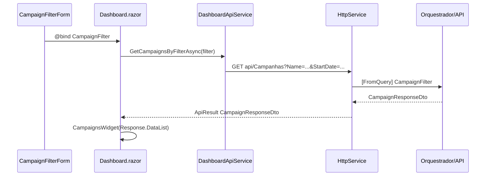

---

## 🚀 DIAGRAMA 5: Afiliados — Engajamento, Comissões e Links (Fase 5)

Visão macro do fluxo de dados da plataforma de automação para afiliados de alta escala. Contratos em `TecFlow.Business/Interfaces/Orchestration/`; persistência de `AffiliateLink` e filas entram na Fase 6.

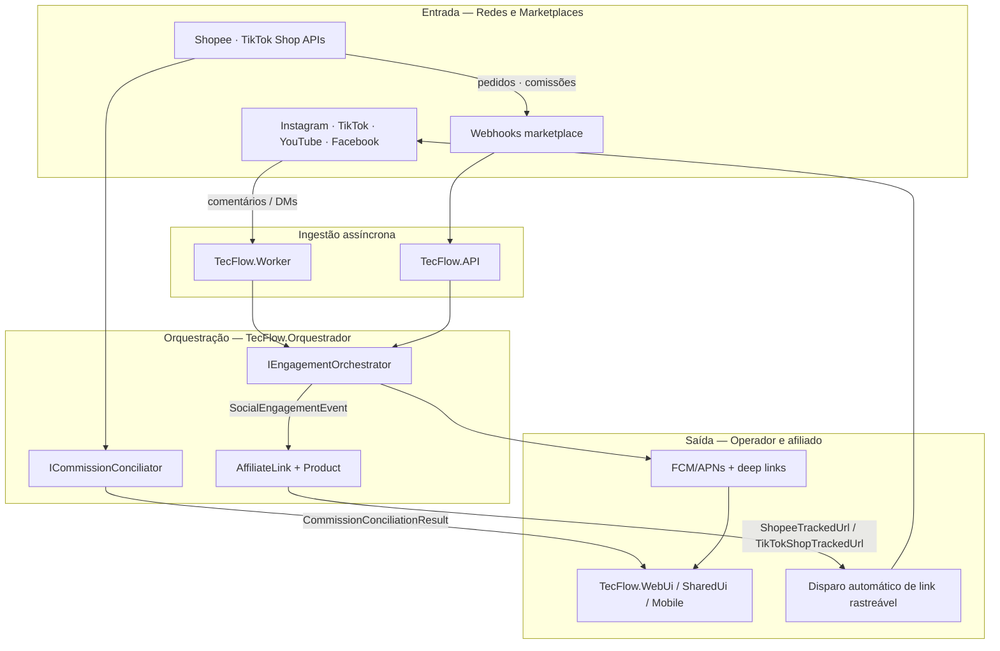

| Camada | Artefatos principais |
|--------|----------------------|
| `TecFlow.Core/Enums` | `SocialMediaType`, `EngagementStatus`, `CommissionStatus`, `MarketplaceType` |
| `TecFlow.Core/Entities` | `AffiliateLink`, `Product`, `MarketplaceOrder`, `Conversion` |
| `TecFlow.Business/Domain` | `Engagement/*`, `Commission/*` |
| `TecFlow.Business/Interfaces/Orchestration` | `IEngagementOrchestrator`, `ICommissionConciliator` |

```
Redes Sociais / Marketplaces
        │
        ▼
Webhooks (API) ──────────────┐
Worker (polling / filas*)    ├──► Orquestrador
        │                    │         ├── IEngagementOrchestrator → link afiliado
        │                    │         └── ICommissionConciliator → auditoria comissões
        ▼                    │
MarketplaceTokens / Orders   │
        │                    ▼
        └────────────► WebUi · Mobile (fila engajamento, painel conciliação)

* filas RabbitMQ — **implementado (Fase 6.1)**
```

---

## 📡 DIAGRAMA 6.4: Observabilidade (OpenTelemetry + Painel de saúde)

```mermaid
flowchart TB
  subgraph Hosts
    API[TecFlow.API]
    WRK[TecFlow.Worker]
    ORQ[TecFlow.Orquestrador]
  end

  subgraph OTel[TecFlow.Observability]
    TR[Traces AspNetCore + HttpClient]
    MT[Metrics comentarios / links / conciliacao]
    LG[Logs OTLP + Console]
  end

  subgraph Export
    PROM[/metrics Prometheus]
    OTLP[OTLP Collector / Seq]
  end

  UI[PainelSaude.razor] --> ORQ
  ORQ --> HealthAPI[GET /api/saude/dashboard]

  API --> OTel
  WRK --> OTel
  ORQ --> OTel
  OTel --> PROM
  OTel --> OTLP
```

| Métrica | Origem |
|---------|--------|
| `comentarios_processados_total` | `SocialMediaCommentConsumer` |
| `links_enviados_sucesso` | Triagem positiva + entrega simulada |
| `erros_conciliacao_contagem` | Falhas em relatórios marketplace |

---

## 📦 DIAGRAMA 6.3: Catálogo global de propaganda e links

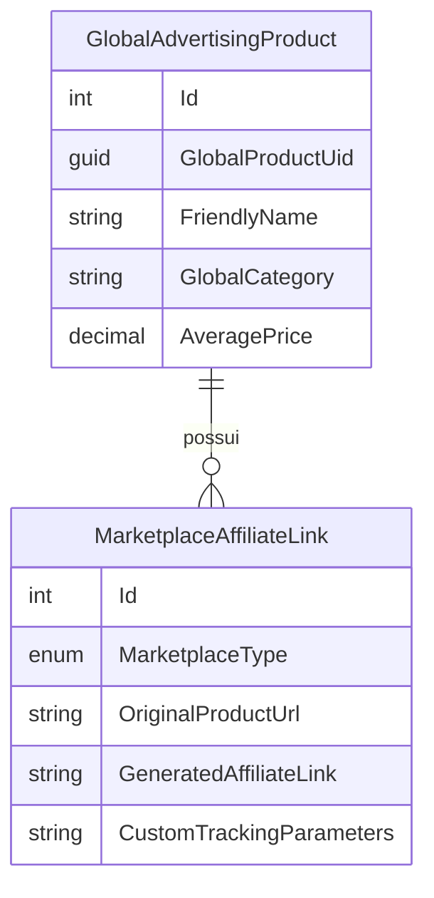

```
ProdutosPropaganda.razor (WebUi/SharedUi)
        │ POST/GET api/propaganda/produtos
        ▼
AdvertisingProductService
        ├── CreateGlobalProductAsync → DB ProdutosPropagandaGlobal
        ├── gera links Shopee/TikTok (sub_id / campaign)
        └── GenerateOptimizedPayloadForPostAsync → robô engajamento (6.1)
```

| Entidade legada | Nova modelagem 6.3 |
|-----------------|-------------------|
| `Product` (estoque) | `GlobalAdvertisingProduct` (divulgação) |
| `AffiliateLink` (conceitual) | `MarketplaceAffiliateLink` (persistido) |

---

## 💰 DIAGRAMA 6.2: Conciliação financeira de afiliado

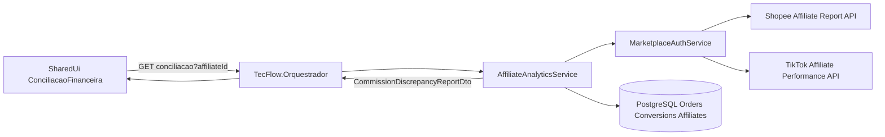

| DTO | Uso |
|-----|-----|
| `AffiliatePerformanceDto` | KPIs no topo do painel |
| `CommissionDiscrepancyReportDto` | Tabela/cards de divergências |
| `AffiliateReconciliationResponseDto` | Envelope API + `PagingInfoDto` |

---

## 📨 DIAGRAMA 6.1: Mensageria — Comentários e Triagem (RabbitMQ + MassTransit)

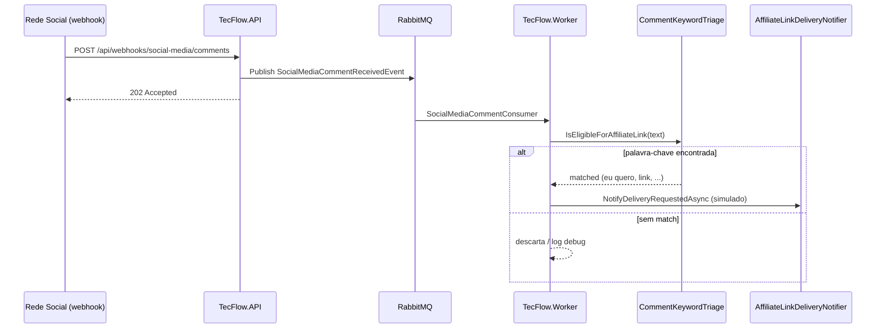

| Componente | Fila / política |
|------------|-----------------|
| Fila principal | `social-media-comment-received` |
| DLQ (erro após retries) | `social-media-comment-received-error` |
| Retry | `RetryCount` × intervalo (`RetryIntervalSeconds`) |
| Publicador | API, Orquestrador (`TecFlowMessagingRole.Publisher`) |
| Consumidor | Worker (`TecFlowMessagingRole.Consumer`) |

```
Instagram/TikTok/... webhook
        │
        ▼
TecFlow.API ──publish──► RabbitMQ ──consume──► TecFlow.Worker
                              │                      │
                              │                      ├── triagem Keywords (appsettings)
                              │                      └── link simulado por PostId
                              └──► DLQ (falha persistente)
```

---

## 📦 DIAGRAMA 7.3: Transação de Estoque Físico (Reserva → Débito → Kardex)

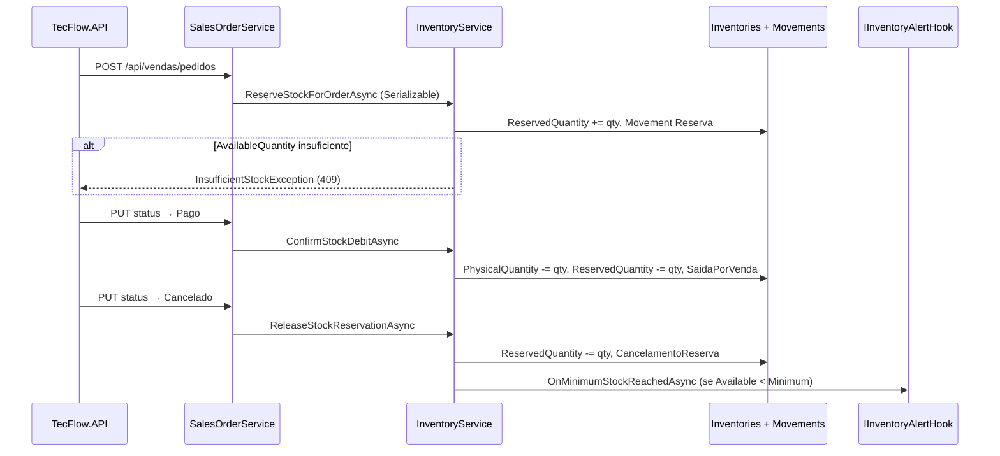

| Método | Quando | Efeito |
|--------|--------|--------|
| `ReserveStockForOrderAsync` | Pedido **Pendente** criado | Bloqueia unidades (anti-overbooking) |
| `ConfirmStockDebitAsync` | **Pago** ou faturamento | Baixa física + zera reserva do pedido |
| `ReleaseStockReservationAsync` | **Cancelado** | Devolve reserva ao disponível |

---

## 🛒 DIAGRAMA 7.2: Ciclo de Vida do Pedido de Venda (ERP Local)

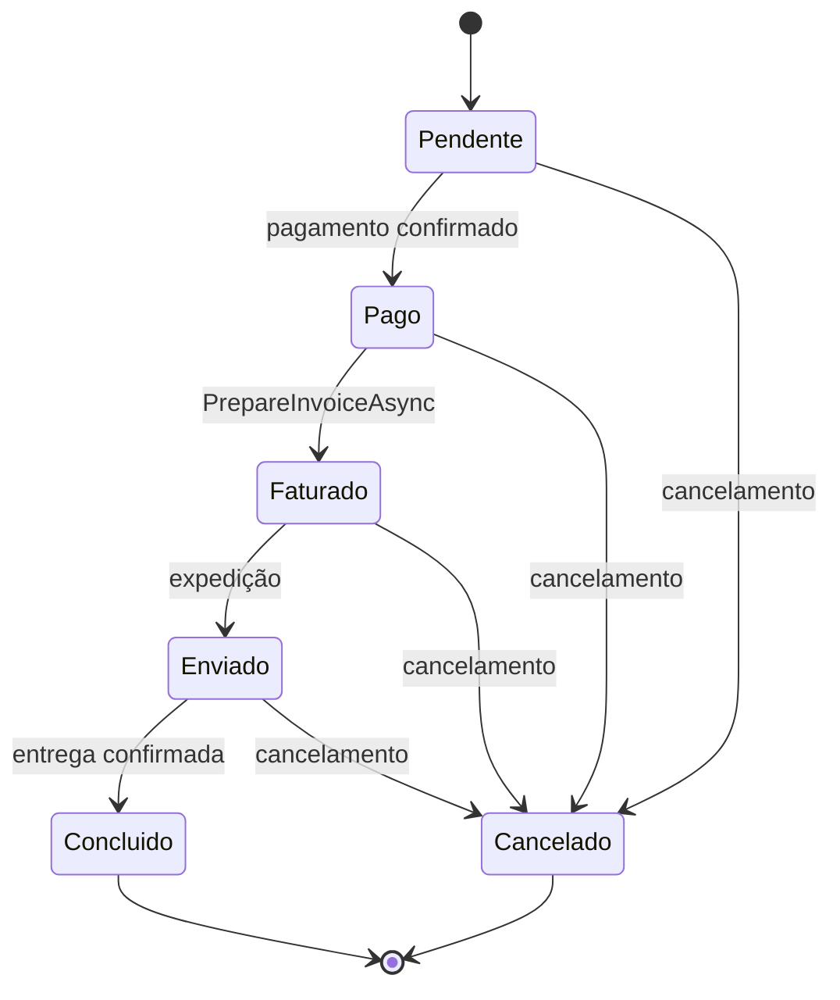

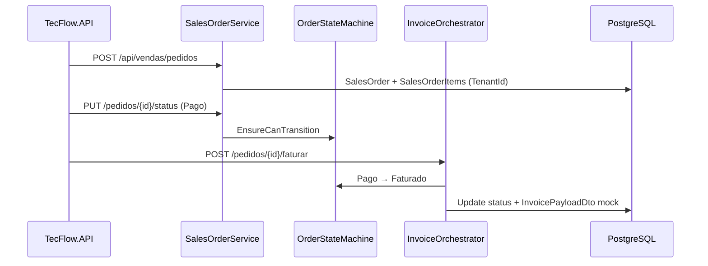

| Entidade | Tabela | Isolamento |
|----------|--------|------------|
| Customer | `Customers` | `TenantId` |
| SalesOrder (Order) | `SalesOrders` | `TenantId` + `ShopId` opcional |
| SalesOrderItem | `SalesOrderItems` | `TenantId` |

**API:** `api/vendas/clientes`, `api/vendas/pedidos`, `POST .../faturar` → gancho NF-e (`InvoicePayloadDto`).

---

## 🏢 DIAGRAMA 7.1: Multi-Tenant / Multi-Conta Marketplace (SaaS Ready)

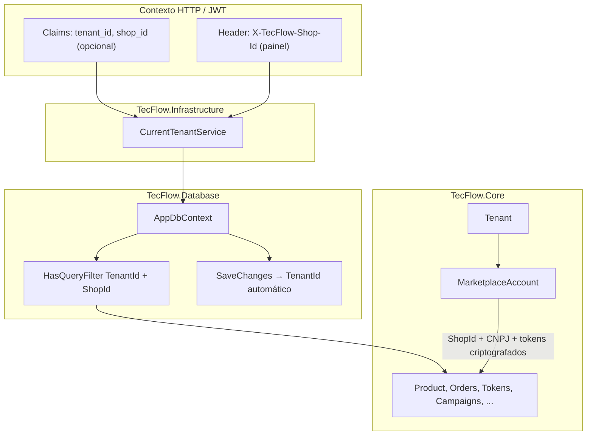

| Camada | Artefato | Função |
|--------|----------|--------|
| Core | `Tenant`, `MarketplaceAccount`, `ITenantScopedEntity` | Modelo SaaS e vínculo multi-loja |
| Database | `ICurrentTenantService`, `TenantQueryFilterExtensions` | Filtros globais EF + escopo manual |
| Infrastructure | `CurrentTenantService` | Extrai `tenant_id` / `shop_id` do JWT ou header |
| Repositories | `ListConsolidated*` / `ListForShop*` | Visão agregada vs. loja única no painel |
| Migração | `AddMultiTenantArchitecture` | Tabelas `Tenants`, `MarketplaceAccounts`, colunas `TenantId` |

```
Request autenticado
    → CurrentTenantService (TenantId + ShopId opcional)
    → AppDbContext query filter (isolamento automático)
    → Repositório: consolidado (ShopId null) OU ForShop(shopId)
```

---

**FIM DOS DIAGRAMAS**

*Sincronizado com pastas físicas em 04/06/2026 (Fase 7 completa — multi-tenant, vendas e estoque físico).*  
*Próximo:* [README.md](../README.md) · [LISTA_ARQUIVOS_MUDANCAS.md](./LISTA_ARQUIVOS_MUDANCAS.md) · [INDICE_COMPLETO.md](./INDICE_COMPLETO.md)
